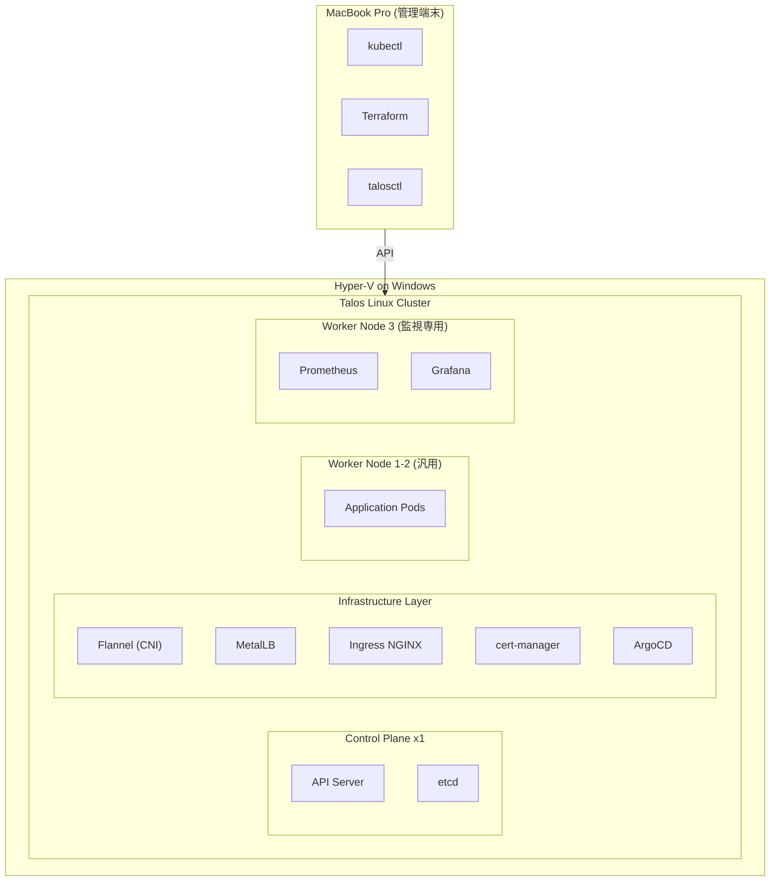

# k8s-advent-2025

**Kubernetesを学ぶ9日間** - Advent Calendar 2025 実装コード

[](https://adventar.org/calendars/11318)
[](https://kubernetes.io/)
[](https://www.talos.dev/)

## 📅 記事一覧

[ジャンルなしオンラインもくもく会 Advent Calendar 2025](https://adventar.org/calendars/11318) の実装コードです。

| Day | 日付 | タイトル | 記事 |
|-----|------|---------|------|
| 1 | 12/3 | アーキテクチャ全体像 | [Qiita](https://qiita.com/august009/items/8f3aa0927a35670c9117) |
| 2 | 12/4 | Talos Linux入門 | [Qiita](https://qiita.com/august009/items/820ced68573b126fe729) |
| 3 | 12/5 | Terraformでクラスタ構築 | [Qiita](https://qiita.com/august009/items/cbcd49069133b2aa4e05) |
| 4 | 12/6 | 監視スタック構築 | [Qiita](https://qiita.com/august009/items/66fb07017558c40492de) |
| 5 | 12/7 | TLS証明書管理 | 公開予定 |
| 6 | 12/10 | Helm と Kustomize | 公開予定 |
| 7 | 12/11 | ArgoCD GitOps実践 | 公開予定 |
| 8 | 12/17 | セキュリティ | 公開予定 |
| 9 | 12/18 | Chaos Mesh障害注入テスト | 公開予定 |

## 🏗️ 構成図



## 🛠️ 技術スタック

| カテゴリ | コンポーネント | バージョン |
|---------|--------------|-----------|
| **OS** | Talos Linux | v1.11.5 |
| **Kubernetes** | Kubernetes | v1.34.1 |
| **IaC** | Terraform | v1.13.x |
| **CNI** | Flannel | - |
| **LoadBalancer** | MetalLB | v0.14.0 |
| **Ingress** | NGINX Ingress | latest |
| **証明書** | cert-manager | latest |
| **監視** | kube-prometheus-stack | latest |
| **GitOps** | ArgoCD | v3.2.0 |

## 📁 ディレクトリ構造

```text
k8s-advent-2025/
├── terraform/                  # Terraform IaC
│   └── hyperv/                 # Hyper-V VM管理
│       ├── main.tf
│       ├── variables.tf
│       └── terraform.tfvars.example
│
├── talos/                      # Talos Linux設定
│   └── patches/                # カスタムパッチ
│
└── kubernetes/                 # Kubernetes マニフェスト
    ├── infrastructure/         # インフラコンポーネント
    │   ├── metallb/
    │   ├── ingress-nginx/
    │   ├── cert-manager/
    │   ├── monitoring/
    │   └── argocd/
    └── apps/                   # サンプルアプリケーション
```

## 🚀 クイックスタート

### 前提条件

- Windows ホスト（Hyper-V 有効化済み）
- 管理端末（Mac/Linux）
  - Terraform >= 1.13.0
  - talosctl >= 1.11.0
  - kubectl >= 1.34.0

### 1. VM 作成

```bash
cd terraform/hyperv
cp terraform.tfvars.example terraform.tfvars
# terraform.tfvars を環境に合わせて編集

terraform init
terraform apply
```

### 2. Talos クラスタ構築

```bash
# 設定ファイル生成
talosctl gen config my-cluster https://<CONTROL_PLANE_IP>:6443

# Control Plane 初期化
talosctl apply-config --insecure --nodes <CP_IP> --file controlplane.yaml
talosctl bootstrap --nodes <CP_IP>

# Worker 追加
talosctl apply-config --insecure --nodes <WORKER_IP> --file worker.yaml
```

### 3. kubeconfig 取得

```bash
talosctl kubeconfig --nodes <CP_IP>
kubectl get nodes
```

### 4. インフラコンポーネントデプロイ

```bash
# MetalLB
kubectl apply -k kubernetes/infrastructure/metallb

# Ingress NGINX
kubectl apply -k kubernetes/infrastructure/ingress-nginx

# 監視スタック（Helm）
helm install monitoring prometheus-community/kube-prometheus-stack \
  -n monitoring --create-namespace \
  -f kubernetes/infrastructure/monitoring/values.yaml.example
```

## ⚙️ カスタマイズ

### MetalLB IP プール

`kubernetes/infrastructure/metallb/config.yaml` で環境に合わせて変更

```yaml
spec:
  addresses:
    - 192.168.1.200-192.168.1.220  # 環境に合わせて変更
```

### Discord 通知

`kubernetes/infrastructure/monitoring/values.yaml.example` をコピーして webhook URL を設定

```yaml
discord_configs:
  - webhook_url: "https://discord.com/api/webhooks/YOUR_ID/YOUR_TOKEN"
```

## 📚 参考リンク

- [Talos Linux 公式](https://www.talos.dev/)
- [Kubernetes 公式](https://kubernetes.io/docs/)
- [MetalLB](https://metallb.universe.tf/)
- [ArgoCD](https://argo-cd.readthedocs.io/)
- [kube-prometheus-stack](https://github.com/prometheus-community/helm-charts/tree/main/charts/kube-prometheus-stack)

## 📜 ライセンス

MIT License - 詳細は [LICENSE](LICENSE) を参照
